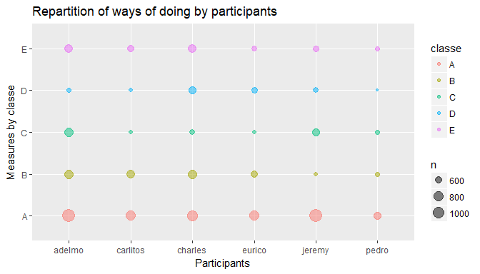
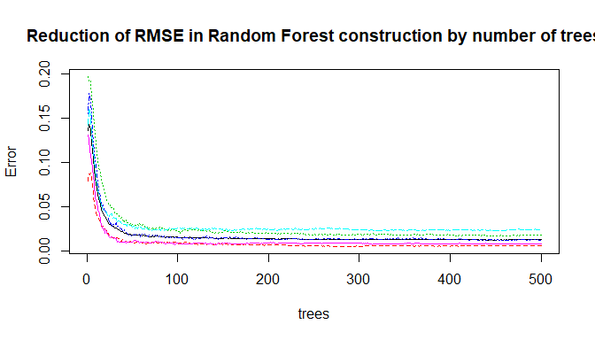
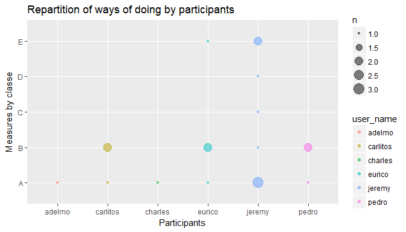

# Project : Machine Learning
JULIA F  
3 aout 2017  


## Introduction

This assignment study movements about participants which perform barbell lifts correctly and incorrectly.
Their devices provides measures of their movements. The objective is to find a model which predict if a move is perform correctly.

## Exploratory analysis

The provided data set is already separate into a training set of 19622 measures and a testing one of 20 mesures. Each contains 160 variables, whose : 

* user_name : factor of 6 values, so 6 participants
* classe    : factor of 5 values for each ways of doing correctly or incorrectly

The variable *classe* doesnt't exists in testing set, we'll must predict it.

<!-- -->

The above graph shows that classe of type are executed by each particpant, so the attribute user_name can be kept.

Furthermore, there is many variables which are mainly empty. They are exclude from the training set after.
This lets 59 'useful' predictors.


## Strategy of cross validation

Since the testing set is small and doesn't contain results, it can't be used to validate models.The training set is sorted which can produced wrong models.

So a strategy of cross validation is necessary to separate the training set into more elements.

So the training set will be randomly separated into two, the training set (75%) and the validation set (25%).


```r
# Exclude all attributes which are mainly empty
dfFitted <- dfTraining
index <- 1
for(i in 1 : 160) {
   if (is.na(dfFitted[1,index])==TRUE | dfFitted[1,index]=="" ) {
      # Remove attribute
      dfFitted <- dfFitted[,-index]
   } else {
      index <- index + 1
   }
}


inTrain = createDataPartition(dfFitted$classe, p = 3/4)[[1]]

training = dfFitted[ inTrain,]

validation = dfFitted[-inTrain,]
```

Furthermore, the k-fold cross validation or bootstrap will be added by default in the next trainings by the functions of training.

## Choice of model

The outcome is a discrete value, so this is a classification problem.

The number of observations is far larger than the number of variables, it should not be a issue.

With these two elements, k-cluster or decision tree models could be appropriate, like *Linear Discriminant Analysis*, *Random Forest* or *k-Nearest Neighbors*.

To compare the three models, I train each one on the training set. Then I predict the outcome on the validation set, which give me the accuracy of the model. 

> For each training function, the preprocessing with "PCA" is activated to do centering and scaling. Without it, we obtain 99% of accuracy on the validation set, but with overfitting on the testing set.


```r
ldaFit <- train(classe ~ ., method = "lda", preProcess = "pca", data = training)
predLDA <- predict(ldaFit, validation)
confLDA<- confusionMatrix(validation$classe, predLDA)  # Accuracy : 0.8424

rfFit <- train(classe ~ ., method = "rf", preProcess = "pca", data = training)
```

```
## Warning in randomForest.default(x, y, mtry = param$mtry, ...): invalid
## mtry: reset to within valid range

## Warning in randomForest.default(x, y, mtry = param$mtry, ...): invalid
## mtry: reset to within valid range

## Warning in randomForest.default(x, y, mtry = param$mtry, ...): invalid
## mtry: reset to within valid range

## Warning in randomForest.default(x, y, mtry = param$mtry, ...): invalid
## mtry: reset to within valid range

## Warning in randomForest.default(x, y, mtry = param$mtry, ...): invalid
## mtry: reset to within valid range

## Warning in randomForest.default(x, y, mtry = param$mtry, ...): invalid
## mtry: reset to within valid range

## Warning in randomForest.default(x, y, mtry = param$mtry, ...): invalid
## mtry: reset to within valid range

## Warning in randomForest.default(x, y, mtry = param$mtry, ...): invalid
## mtry: reset to within valid range

## Warning in randomForest.default(x, y, mtry = param$mtry, ...): invalid
## mtry: reset to within valid range

## Warning in randomForest.default(x, y, mtry = param$mtry, ...): invalid
## mtry: reset to within valid range

## Warning in randomForest.default(x, y, mtry = param$mtry, ...): invalid
## mtry: reset to within valid range

## Warning in randomForest.default(x, y, mtry = param$mtry, ...): invalid
## mtry: reset to within valid range

## Warning in randomForest.default(x, y, mtry = param$mtry, ...): invalid
## mtry: reset to within valid range

## Warning in randomForest.default(x, y, mtry = param$mtry, ...): invalid
## mtry: reset to within valid range

## Warning in randomForest.default(x, y, mtry = param$mtry, ...): invalid
## mtry: reset to within valid range

## Warning in randomForest.default(x, y, mtry = param$mtry, ...): invalid
## mtry: reset to within valid range

## Warning in randomForest.default(x, y, mtry = param$mtry, ...): invalid
## mtry: reset to within valid range

## Warning in randomForest.default(x, y, mtry = param$mtry, ...): invalid
## mtry: reset to within valid range

## Warning in randomForest.default(x, y, mtry = param$mtry, ...): invalid
## mtry: reset to within valid range

## Warning in randomForest.default(x, y, mtry = param$mtry, ...): invalid
## mtry: reset to within valid range

## Warning in randomForest.default(x, y, mtry = param$mtry, ...): invalid
## mtry: reset to within valid range

## Warning in randomForest.default(x, y, mtry = param$mtry, ...): invalid
## mtry: reset to within valid range

## Warning in randomForest.default(x, y, mtry = param$mtry, ...): invalid
## mtry: reset to within valid range

## Warning in randomForest.default(x, y, mtry = param$mtry, ...): invalid
## mtry: reset to within valid range

## Warning in randomForest.default(x, y, mtry = param$mtry, ...): invalid
## mtry: reset to within valid range

## Warning in randomForest.default(x, y, mtry = param$mtry, ...): invalid
## mtry: reset to within valid range

## Warning in randomForest.default(x, y, mtry = param$mtry, ...): invalid
## mtry: reset to within valid range

## Warning in randomForest.default(x, y, mtry = param$mtry, ...): invalid
## mtry: reset to within valid range

## Warning in randomForest.default(x, y, mtry = param$mtry, ...): invalid
## mtry: reset to within valid range

## Warning in randomForest.default(x, y, mtry = param$mtry, ...): invalid
## mtry: reset to within valid range

## Warning in randomForest.default(x, y, mtry = param$mtry, ...): invalid
## mtry: reset to within valid range

## Warning in randomForest.default(x, y, mtry = param$mtry, ...): invalid
## mtry: reset to within valid range

## Warning in randomForest.default(x, y, mtry = param$mtry, ...): invalid
## mtry: reset to within valid range

## Warning in randomForest.default(x, y, mtry = param$mtry, ...): invalid
## mtry: reset to within valid range

## Warning in randomForest.default(x, y, mtry = param$mtry, ...): invalid
## mtry: reset to within valid range

## Warning in randomForest.default(x, y, mtry = param$mtry, ...): invalid
## mtry: reset to within valid range

## Warning in randomForest.default(x, y, mtry = param$mtry, ...): invalid
## mtry: reset to within valid range

## Warning in randomForest.default(x, y, mtry = param$mtry, ...): invalid
## mtry: reset to within valid range

## Warning in randomForest.default(x, y, mtry = param$mtry, ...): invalid
## mtry: reset to within valid range

## Warning in randomForest.default(x, y, mtry = param$mtry, ...): invalid
## mtry: reset to within valid range

## Warning in randomForest.default(x, y, mtry = param$mtry, ...): invalid
## mtry: reset to within valid range

## Warning in randomForest.default(x, y, mtry = param$mtry, ...): invalid
## mtry: reset to within valid range

## Warning in randomForest.default(x, y, mtry = param$mtry, ...): invalid
## mtry: reset to within valid range

## Warning in randomForest.default(x, y, mtry = param$mtry, ...): invalid
## mtry: reset to within valid range

## Warning in randomForest.default(x, y, mtry = param$mtry, ...): invalid
## mtry: reset to within valid range

## Warning in randomForest.default(x, y, mtry = param$mtry, ...): invalid
## mtry: reset to within valid range

## Warning in randomForest.default(x, y, mtry = param$mtry, ...): invalid
## mtry: reset to within valid range

## Warning in randomForest.default(x, y, mtry = param$mtry, ...): invalid
## mtry: reset to within valid range

## Warning in randomForest.default(x, y, mtry = param$mtry, ...): invalid
## mtry: reset to within valid range

## Warning in randomForest.default(x, y, mtry = param$mtry, ...): invalid
## mtry: reset to within valid range
```

```r
predRF <- predict(rfFit, validation)
confRF<- confusionMatrix(validation$classe, predRF)  # Accuracy : 0.989

knnFit <- train(classe ~ ., method = "knn", preProcess = "pca", data = training)
predKNN <- predict(knnFit, validation)
confKNN<- confusionMatrix(validation$classe, predKNN)  # Accuracy : 0.9745


# Table of accuracy :
tableAccuracies <- c(LDA = confLDA$overall[1], RandomForest = confRF$overall[1], KNN = confKNN$overall[1])
```


```r
tableAccuracies
```

```
##          LDA.Accuracy RandomForest.Accuracy          KNN.Accuracy 
##             0.8423736             0.9887847             0.9749184
```


**Random Forest seems to provides the better accuracy with 0.989.**

## Expected out of sample error 

An other method of comparison of models is the Root Means Squared Errors (RMSE) : 

$RMSE = \sqrt{mean((testValue - predictedValue)^2)}$

The predictions must be applied in the validation set.

With a classification problem the difference operation can be replaced by an unequality.

This equation products the following results :


```r
rmseLDA <- sqrt(mean(( predLDA != validation$classe )^2))
rmseRF  <- sqrt(mean(( predRF  != validation$classe )^2))
rmseKNN <- sqrt(mean(( predKNN != validation$classe )^2))

tableRMSE <- c(LDA = rmseLDA, RandomForest = rmseRF, KNN = rmseKNN)
print(tableRMSE)
```

```
##          LDA RandomForest          KNN 
##    0.3970219    0.1059025    0.1583716
```

Identically, RMSE is lesser with Random Forest, so it is the better model.


```r
plot(rfFit$finalModel, main = "Reduction of RMSE in Random Forest construction by number of trees")
```

<!-- -->

**For the following, I select the Random Forest model to predict the outcome.**

## Prediction through test cases 

To predict the outcome on the test case, the previous trained Random Forest model is used :


```r
predTesting <- predict(rfFit, testing)
matricePredict <- data.frame(predTesting)
print(matricePredict)
```

```
##    predTesting
## 1            B
## 2            A
## 3            A
## 4            A
## 5            A
## 6            E
## 7            D
## 8            B
## 9            A
## 10           A
## 11           B
## 12           C
## 13           B
## 14           A
## 15           E
## 16           E
## 17           A
## 18           B
## 19           B
## 20           B
```

```r
# Plot the predicted values
ggplot(data = testing, aes(y = predTesting, x = user_name, col = user_name)) +
   geom_count(alpha = 0.5) +
   ggtitle("Repartition of ways of doing by participants") +
   xlab("Participants") + 
   ylab("Measures by classe")
```

<!-- -->

This outcomes should be the manner in which they did the exercise into the testing set.

